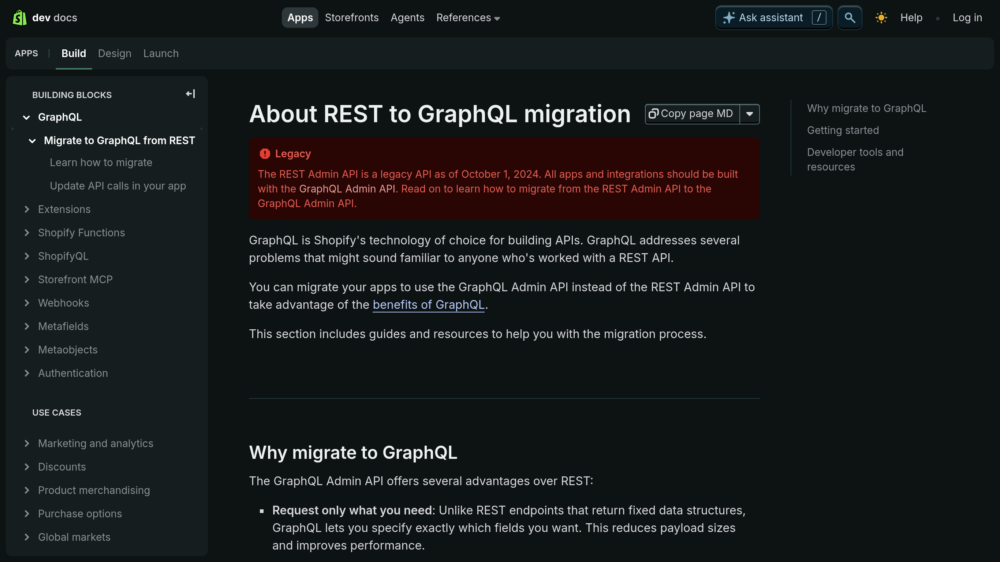

# Plano de desenvolvimento

Este é um projeto B2B voltado a mercadores que utilizam o Shopify para gerenciar seu e-commerce.

## Requisitos não-funcionais

- Utilizar o framework [Next.js](https://nextjs.org)
- Código hospedado no [Github](http://github.com)

## Requisitos funcionais

1. Listagem com todas as tags únicas de produtos.
2. Ver todos os produto para cada tag selecionada.
    - Mostrar também a quantidade total de cada item no inventário.

### 1. Página com listagem das tags únicas dos produtos

Crie uma página com as seguintes funcionalidades, em que:

- Retorna todos os produtos da API de produtos do Shopify.
- Extrai todas as tags únicas dos produtos.
- Mostra a listagem das tags únicas de produtos (e.g. Aerodynamic, Clock, Concrete).
- Permite clicar em uma tag para navegar a correspondente página de listagem de produtos. Por exemplo: /tags/aerodynamic.

### 2. Página com listagem de produtos

Crie uma página para a tag selecionada, em que:

- Lista todos os produtos que tenham uma tag.
- Para cada produto mostra no mínimo:
    - Nome do produto.
    - Quantidade total disponível deste item em todas as variantes disponíveis.

## Acionáveis

### 1. Design e implementação do layout base da aplicação

Como o intuito da aplicação é muito parecido com o https://admin.shopify.com, me inspirei bastante no layout na hora de fazer o design.

Para implementar a UI escolhi o `@shadcn/ui` com `tailwindcss`, sendo assim consegui construir um design system próprio em que consigo fazer alterações.  
O paleta de cores escolhida é o `@radix-ui/colors`, toda a aplicação utiliza variáveis CSS para estilização, sendo assim a troca de tema é trivial.

### 2. Deploy contínuo em produção na Vercel.

A aplicação está acessível nesse link: https://tagify-dengun.vercel.app.

### 3. Proxy para a API do Shopify

De acordo com a documentação do Shopify, a API REST do Admin deles está depreciada apartir do dia 1 de Abril de 2025.  
Com a recomendação sendo migrar para API GraphQL.

> Fonte: https://shopify.dev/docs/apps/build/graphql/migrate

Implementei o projeto utilizando a API GraphQL do Shopify, com uma loja populada com dados de desenvolvimento.  
A aplicação se comunica com a API GraphQL do Shopify por meio de HTTP e optei não utilizar os clients oficiais para que eu consiga utilizar a `fetch` API do NextJS, que dentro dos internos do framework passa por um patch para que features como caching sejam habilitadas.

E para que todas as queries sejam typesafe dentro do projeto existe um arquivo chamado `.graphqlrc.ts` que é responsável por passar as informações de tipos para o language server do editor e também para realizar codegen dos tipos que vem do Shopify com a biblioteca `@shopify/api-codegen-preset` e o codegen é executado com o comando `graphql-codegen`, criando os arquivos de tipo em `src/lib/shopify/types`.

E como para executar essas chamadas para a API do Shopify precisamos de variáveis de ambiente que são extremamente sensíveis — vide `.env.example`, criei rotas server-side com o NextJS que fazem proxy para a API do Shopify, e também habilitam caching de cada request, com um determinado tempo de invalidação, assim temos um cache compartilhado para cada resposta, e se necessário podemos invalidar o cache para buscar recursos mais novos.

### 4. Integrar nosso proxy com o Frontend

Usando client e server components podemos exibir os dados vindo das rotas proxy dentro do nosso frontend.  
Para fazer isso temos cache async client-side com `@tanstack/react-query`, assim podemos gerenciar estado de erro, sucesso e carregamento, além de inúmeras outras features como revalidação de cache.

### 5. Implementar filtragem usando query params

Queremos habilitar a filtragem tanto por tags de produto, tanto quanto por status.

## Entrega

A entrega desse projeto consiste nos seguintes passos sendo executados:

1. Uma captura de tela do app mostrando a listagem de tags.
2. Uma captura de tela do app mostrando a página de listagem de produtos ao clicar na tag "Aeroynamic".
3. Link para o repositório do GitHub.
